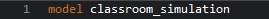
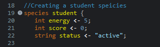
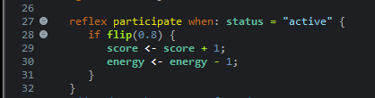
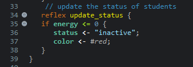
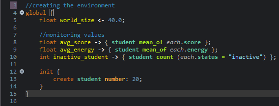
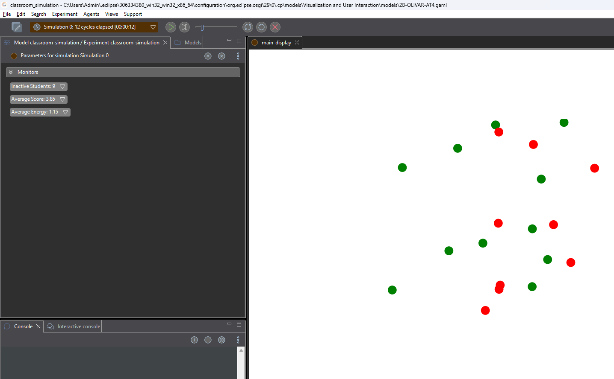
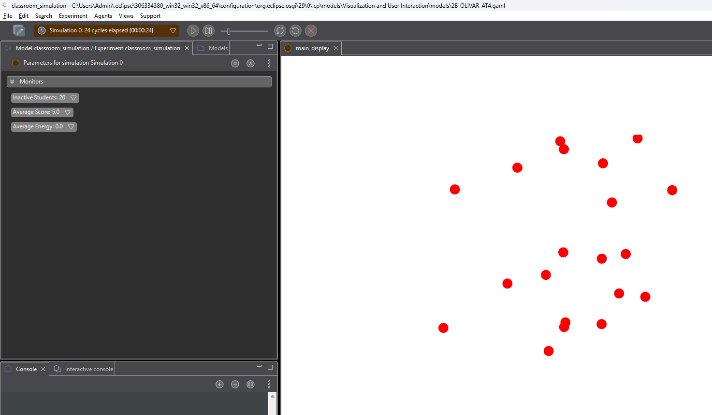
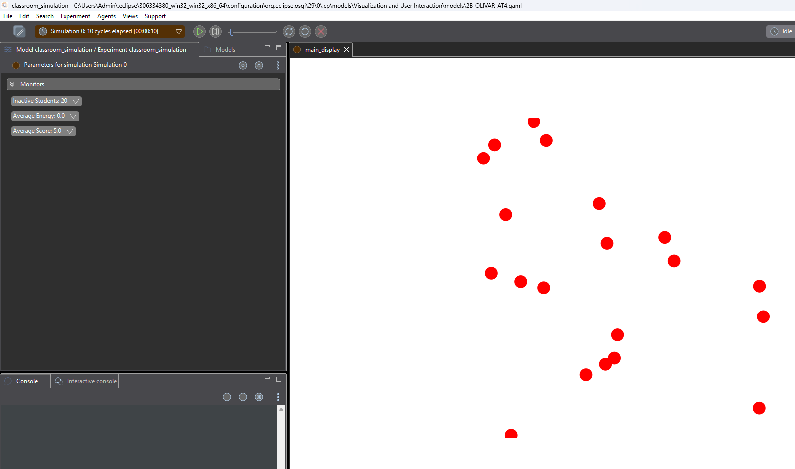

# Introduction to Intelligent System
# Agent Behaviors and Reflexes in Agent-Based Systems
# Mike Vincent E. Olivar
# BSCS 2B - CSEL 302

# Part 1: Simulation Scenario
You will create a simple classroom simulation.
Each student agent has the following attributes

**Attributes**          **Description**
Energy                  Ability of the student to participate
Score                   Participation score
Status                  Active or inactive

*Rules*
    1. Student may participate in class.
    2. When participating:
        - score increases by 1
        - energy decreases by 1
    3. When energy reaches 0, the student becomes inactive.

# Part 2: Step 1: Create the model
Create a new GAMA model.
Example:
model classroom_simulation

Proof:

# Part 3: Step 2: Define the Student Agent
Create a student species.
Example:
species student {
    int energy <- 5;
    int score <- 0;
    string status <- "active";
}

Proof:

# Part 4: Step 3: Add Behavior (Participation)
Students randomly participates in class.
Example:
reflex participate when status: "active" {
    if flip(0.4) {
        score <- score + 1;
        energy <- energy -1;
    }
}
Explanation:
- flip(0.4) means 40% chance of participation.

Proof:

# Part 5: Step 4: Add Reflex for the Status Update
When energy reaches 0, change the status.

reflex update status {
    if energy <= 0 {
        status <- "inactive";
    }
}

Proof:

# Part 6: Step 5: Create the Environment
Add the global section.

global {
    init {
        create student number: 20;
    }
}
I included a monitoring values in the simulation.

Proof:

# Part 7: Step 6: Run the Simulation.
Observe the following.
• Which students participate the most
• How energy changes over time
• When students become inactive

Simulation after 12 cycles:

Simulation after 24 cycles:

Simulation after 10 cycles with 0.8 participation probability:

# Part 8: Guide Questions
1. What happens to student when energy reaches 0?
    - students, whose energy reaches 0, becomes inactive in the classroom simulation. It shows a real-world scenario that when a student is exhausted, participation rate becomes lower.

2. How does participation affects score and energy?
    - while student participate during the classroom simulation, the score is increased while the energy is decreased.

3. If participation probability incease to 0.8, what happens?
    - If the value of participation probability was increased from 0.4 to 0.8, the rate of energy depletion becomes faster (around 10 cycles) compared to 0.4 that takes around 24 cycles before the energy reaches 0.

4. What pattern do you observe in the simulation?
    - Even after changing the participation probability from 0.4 to 0.8, what I have observed in the simulation is that agents usually placed in the center are the most active in participation and the last to reach 0 energy. The result are similar even after testing the simulation multiple times.