# Introduction to Intelligent System
# Modeling Student Attention and Performance using Agent-Based Simulation
# Mike Vincent E. Olivar
# BSCS 2B - CSEL 302

# Part 1 - Pre-Lab Concept Questions
1. What is an Agent-Based Model? 
    - agent is an individual entity in the simulation that can make decisions or perform actions based on rules. Each type of agent acts independently and interacts with other agents or environment. One of the best example is a classroom simulation whereas each student can be an agent that has it owns behavior in class. 

2. What is the difference between global and species variables?
    
    *Global Variables*
    - global variables are variables that belongs to the entire simulation. They store information that is shared by all agents which means every agent in the model can access or use these values.

    *Species Variables*
    - species variables belongs to a specific type of agent (species). Each agent has it own value for that variable.

3. What does this expression means?
    *student mean_of each.attention*
    - this expression calculates the average attention of each students agents in the simulation.

4. What happens if attention continuously decrease without a break?
    - continuous decrease of attention without break in a classroom simulation will result to low attention level. This means that students will be less focused or inattentive. If prolonged, the model may show that students stop participating or learning effectively because their attention level has dropped entirely.

    
# Part 2: Run the Bas Model
Step 1: Run the provided model.
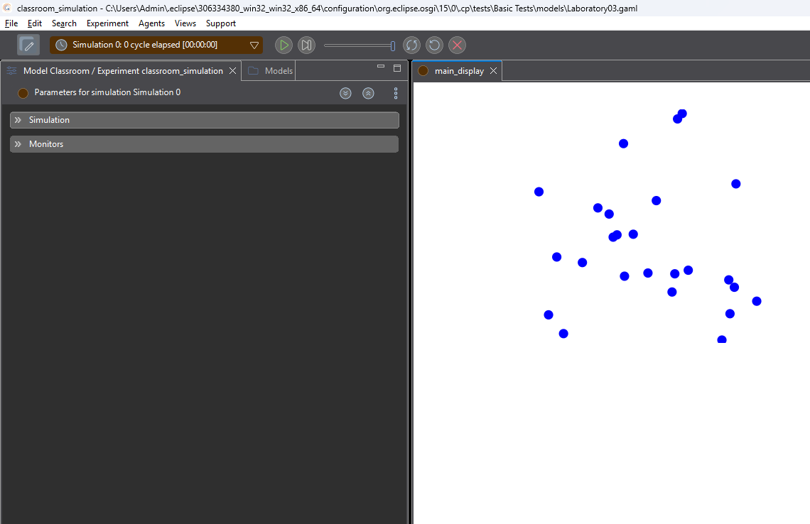

Step 2: Observe
    -Student movement
    -Color changes
    -Monitor values 
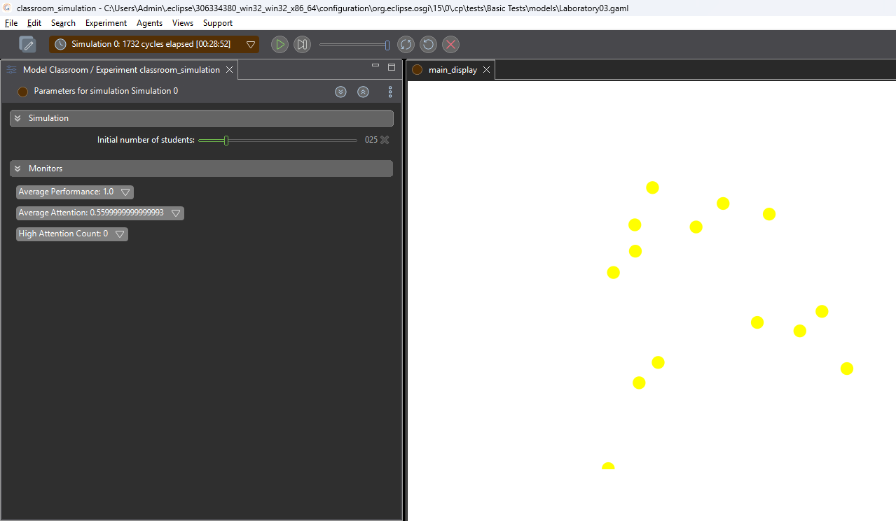

Step 3: Open the generated file: classroom_data.csv
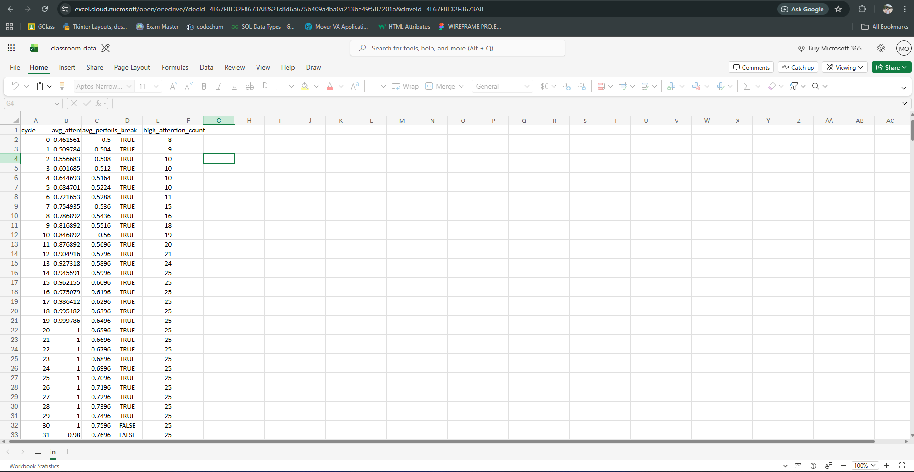

# PART 3 — Data Observation Table
Fill in the table after 100 cycles: 
|------------------------------------------------|
| *Metric*                  |   *Value*          |
| ------------------------- + ------------------ |
| Average Attention         | 0.7799999999999998 |
| Average Performance       | 1.0                |
| High Attention Count      | 25 students        |
| Number of Breaks Occurred | 2 breaks           |
|------------------------------------------------|

# Part 4: Guided Code Analysis

# Activity 1: Break Frequency
Original code: 
if (cycle mod 30 = 0)

Task: 
Change break interval to:
15 cycles

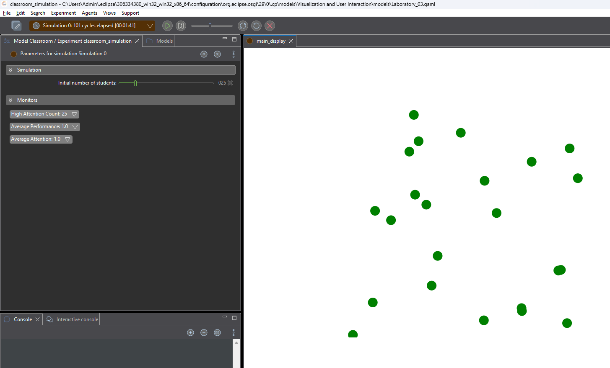

**Questions:**
1. Does attention increase faster?
    - Yes. Attention increase faster than before because breaks are more frequent.
2. Does performance grow faster?
    - Yes. When a student attention is increased, performance will also improve since they are more focused.
3. Is the system more stable?
    - The system was also stable even before the changes happened.

# Activity 2: Attention Decay Rate

Original:
attention <- max(0.0, attention - 0.02);

Task:
Change decay rate to:
0.05

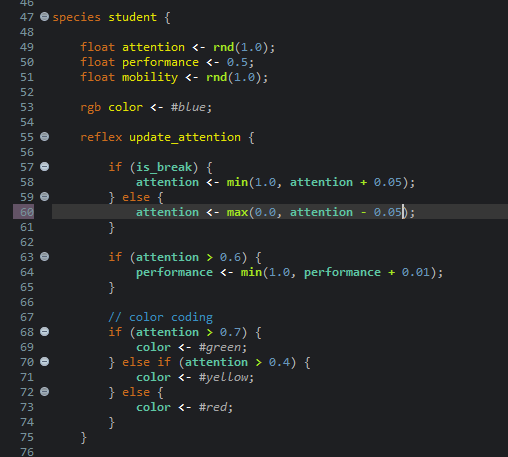

**Observe:**
• Does attention collapse?
    - Yes. Sudden change in the value (increasing the decay rate) in attention rate of the student affects their attention performance. This changes means that the attention of students decrease faster every cycle.

• Does performance still improve?
    - No. There is a slight changes in the students performance since it is related to their attention. Students whose attention easily decrease also decreases perfomance.

# Activity 3: Performance Growth Condition

Original:
if (attention > 0.6)

Task:
Change threshold to:
0.8
Questions:
• Does performance improve slower?
    - Yes. The requirement to gain performance became much more stricter since the threshold was increased from 0.6 to 0.8.
• What does this represent in real classroom settings?
    -   In real classroom setting, students' attention naturally decreases overtime. Because attention is constantly decreasing and only slight increase happens in breaks, only fewer students are able to reach attention above 0.8. This results to slow performance growth in class.

# Part 5 — Experiment: Class Size Impact (30 minutes) Use parameter: Initial number of students Test: 
|--------------------------------------------------------|
| **Students** | **Avg Attention** | **Avg Performance** |
| ------------ + ----------------- + --------------------|
| 10 	       |0.7199667833215277 | 0.7220000000000002  |  
| 25 	       |0.7138281562909949 | 0.7312000000000002  | 
| 60 	       |0.7093573645898215 | 0.7230000000000003  | 
| 100          |0.7257212219105085 | 0.7516000000000004  | 
|--------------------------------------------------------|

10 Students:
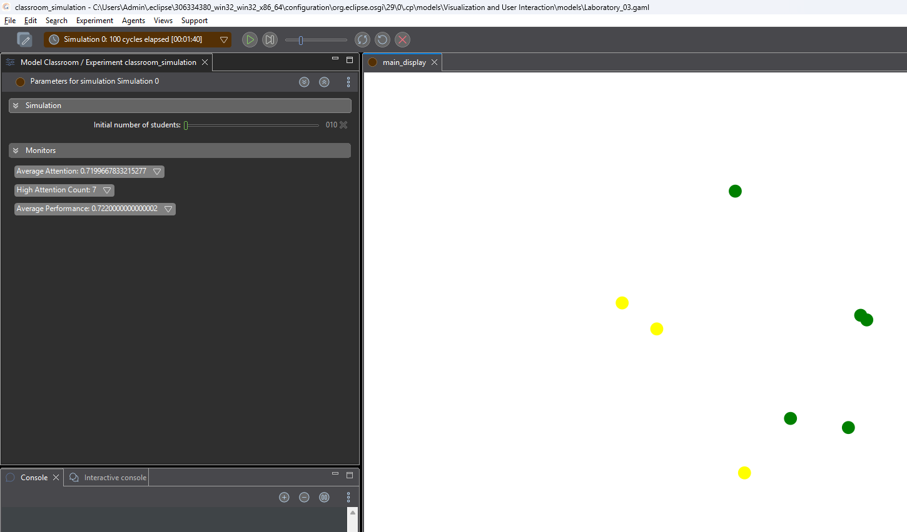

25 Students:
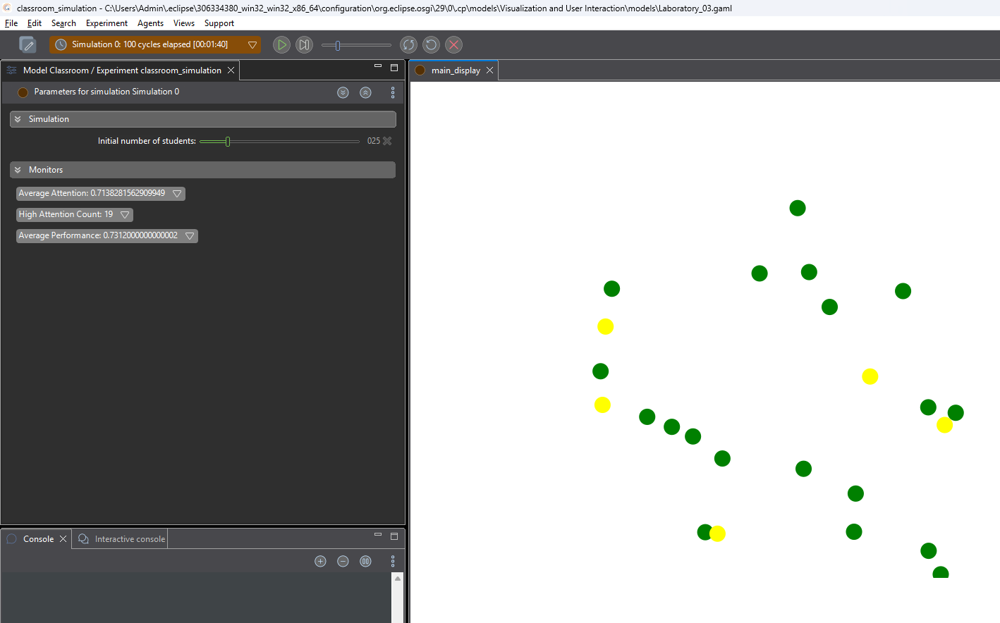

60 Students:
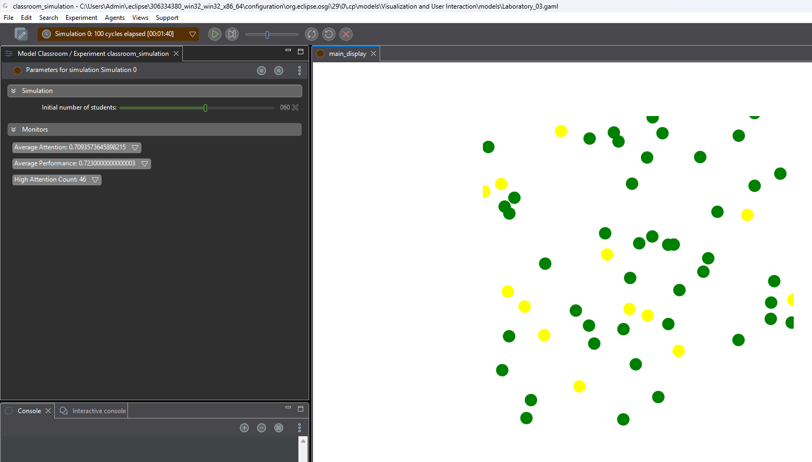

100 Students:
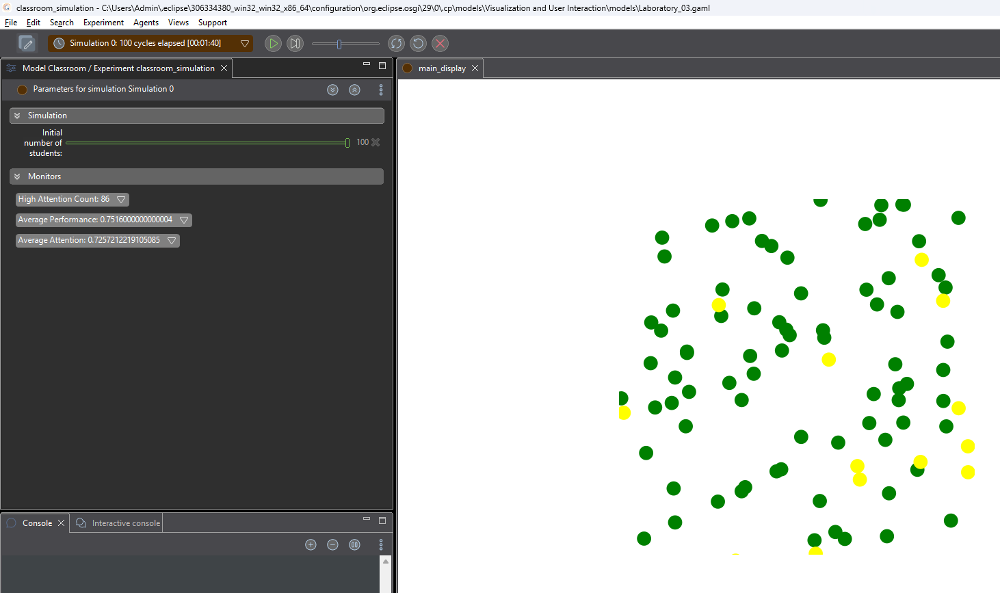

Analysis Questions:
1. Does increasing class size affect average attention?
    - Yes. Even though there are few changes in the values of average attention, increasing the class size still has a valid effect. 
2. Does mobility create more randomness
    - Yes. Since the movement direction is random, the behavior of students becomes less predictable. Including mobility in the attributes of students introduces variability in the simulation process and outcomes.
3. Is emergent behavior visible?
    - Yes. The program provides a simple rule for each student to follow (attention increase and decrease, performance). The simulation also provide a trend whereas the performance and attention are affected by the attendance of students. 

# Part 6 — Data Analysis Task (Optional Python) 
Using Excel or Power Query Editor 
1. Load classroom_data.csv 
2. Plot: 
  o 	Attention vs Cycle 
  o 	Performance vs Cycle 
3.	Identify break cycles. 
4.	Compute correlation between attention and performance. 

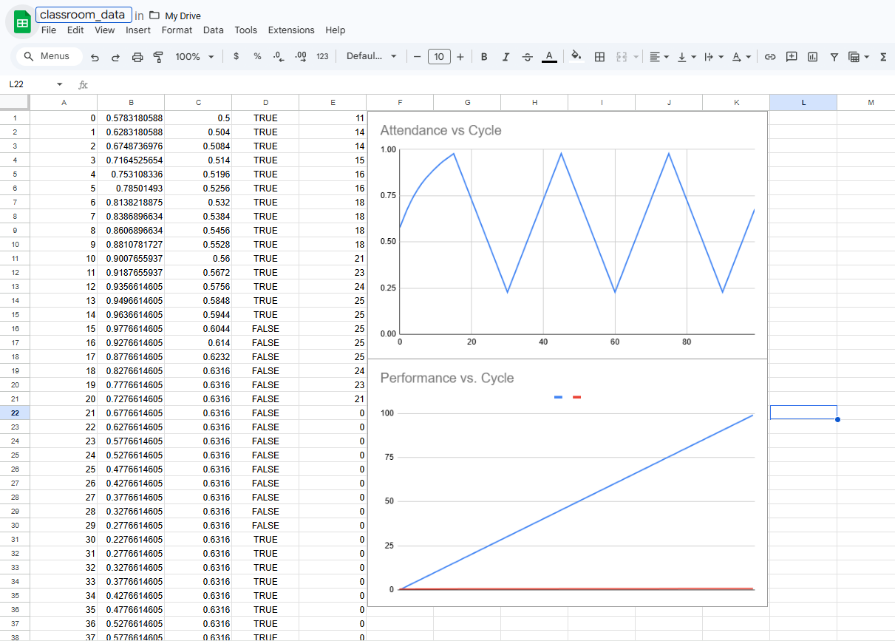

# Part 7: Critical Thiking Questions
1. Why does performance only increase when attention > 0.6?
    -   Performance only increase when attention is less than 0.6 because it only requires an average attention in the classroom simulation. When the threshold was modified to a higher value, performance growth becomes slower since it requires stricter attention level to the students.

2. Is this model deterministic or stochastic?
    - The model is considered as stochastic since it includes randomness in the behavior of the student (agents). Some examples of behaviors given to the agen in this model are: location, attention, mobility with the use of *rnd()* function.

3. What real-world classroom factors are missing?
    - There are several real-world classroom factors that are not included in this model. For example, peer influence. When a student is seated near to high-attention student (probably a classmate), the attention level of that student should also increase. 

4. How would peer influence affect the system?
    - Creating a behavior such as peer influence can make the simulation closer to a real-world classroom situation. In a real classroom, students are often affected by the behavior and focus of the people around them. If many students are attentive, others may also become more focused.

# Part 8: Advance Extension Task
Option A: Peer Influence
Add logic:
• Students near high-attention peers increase attention.

Proof:
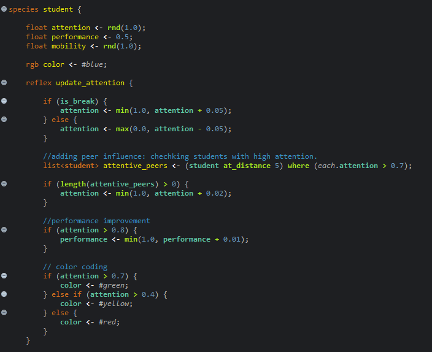

Simulation:
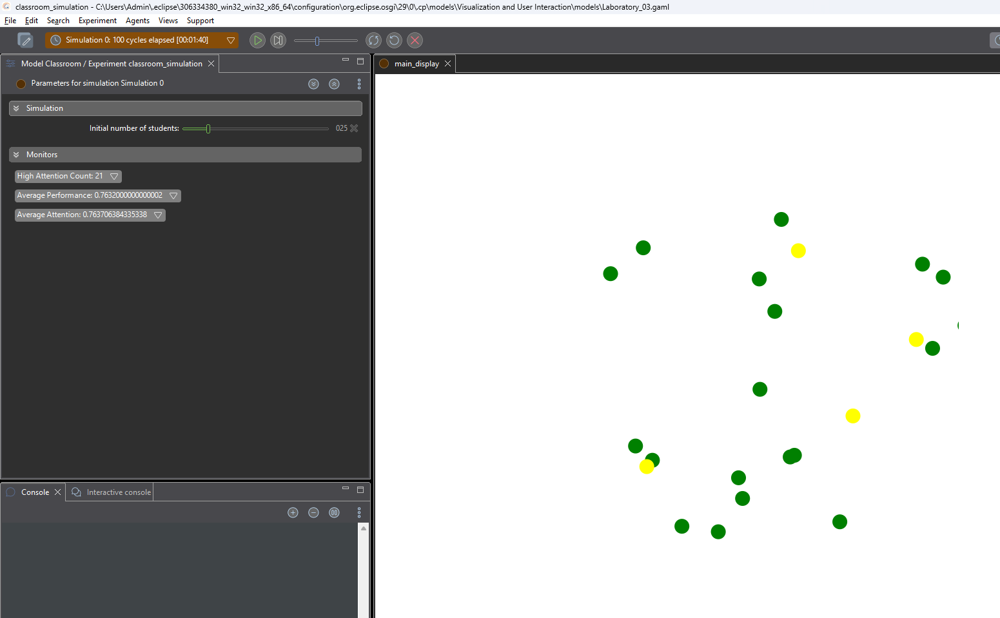

